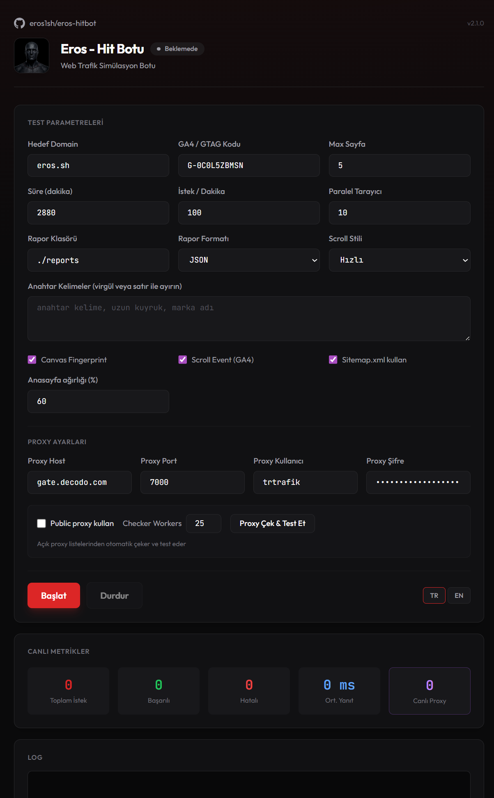
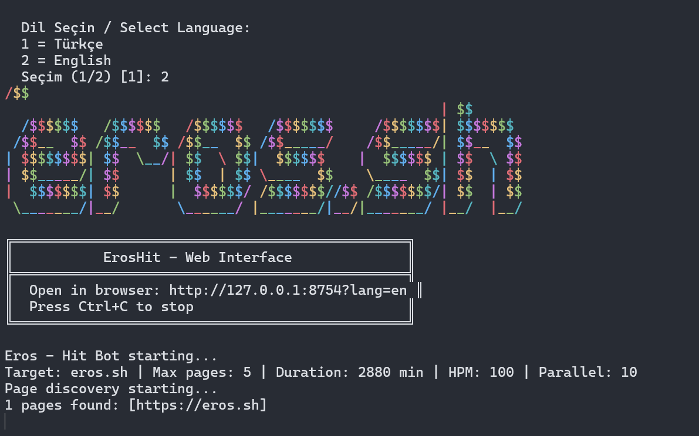

# Eros Hit Bot

[](https://golang.org)
[](https://opensource.org/licenses/MIT)
[](https://github.com/eros1sh/eros-hitbot/releases)

**Parasitic SEO traffic simulation tool** — Simulate organic search traffic, boost search engine rankings, and verify analytics (GA4/GTM) through realistic, keyword-driven web visits.

<p align="center">
  
</p>

---

## Table of Contents

- [Overview](#overview)
- [What's New in 2.1.0](#whats-new-in-210)
- [What's New in 2.0](#whats-new-in-20)
- [Features](#features)
- [Installation](#installation)
- [Quick Start](#quick-start)
- [Configuration](#configuration)
- [Usage](#usage)
- [Releases](#releases)
- [Architecture](#architecture)
- [Contributing](#contributing)
- [License](#license)

---

## Overview

Eros Hit Bot is an open-source **parasitic SEO** tool that generates simulated organic traffic to improve your website's search engine rankings. By mimicking real user behavior—including search referrers, varied fingerprints, and analytics events—it helps your target pages accumulate engagement signals that search engines interpret as organic interest.

### How It Works

1. **Keyword-driven traffic** — You define target keywords; the bot simulates visits originating from Google, Bing, and other search engines.
2. **Realistic fingerprinting** — Each visit uses unique user agents, screen sizes, timezones, and canvas/WebGL fingerprints to avoid detection.
3. **Analytics integration** — GA4/GTM events (page views, scrolls, clicks) are triggered so your analytics reflect the traffic.
4. **Parallel execution** — Multiple browser contexts run concurrently for higher throughput.

---

## What's New in 2.1.0

### UI/UX Improvements
- **Tailwind CSS redesign** — Modern, cleaner interface with improved visual hierarchy and responsive grid layouts
- **Public proxy integration** — Public proxy settings moved into the main Proxy Settings section for better organization
- **Live proxy metric** — New metric card showing real-time count of active public proxies (purple theme)
- **Loading states** — "Fetch & Test Proxies" button now shows a spinning animation during proxy testing with real-time status polling
- **GitHub link** — Repository link added to the header with version badge (v2.1.0)

### Bug Fixes & Code Quality
- **Fixed deprecated `rand.Seed()`** — Migrated to `math/rand/v2` and `crypto/rand` for Go 1.22+ compatibility
- **Fixed race condition in crawler** — Added mutex protection for `startTime` map in request/response handlers
- **Fixed race condition in LivePool** — `GetNext()` now uses single lock for thread-safe proxy rotation
- **Fixed nil pointer dereference** — Added null checks for visitor in simulator's public proxy mode
- **Improved error handling** — All chromedp operations now properly handle errors (non-critical errors are logged but don't break flow)
- **Fixed memory leak** — Reporter log channel now properly closes; added `Close()` method to prevent goroutine leaks
- **Graceful shutdown** — HTTP server now handles SIGINT/SIGTERM with 5-second timeout for clean shutdown

### Technical Changes
- **Go 1.21+ compatible** — Uses standard `math/rand` package for broad compatibility
- **Improved proxy status API** — `/api/proxy/status` now returns `checking` flag for UI polling

---

## What's New in 2.0

- **Sitemap.xml support** — Optional checkbox to use sitemap. If the site has `sitemap.xml` (or a Sitemap entry in `robots.txt`), URLs are loaded from there; otherwise page discovery (crawler) is used.
- **Homepage weight** — When sitemap is enabled, a configurable percentage of requests go to the homepage and the rest are distributed randomly across sitemap URLs (default 60% homepage).
- **HPM (hits per minute) fix** — Token bucket enforces the actual HPM limit; a new visit starts as soon as a slot is free, and all parallel slots fill quickly at startup.
- **Visit timeout** — Per-visit timeout increased from 30s to 90s for slow pages; reduces `context deadline exceeded` and many `ERR_TIMED_OUT` errors.
- **Fetch blocking fix** — Document and Script are never blocked; only Image, Stylesheet, Font, and Media are blocked, fixing `ERR_BLOCKED_BY_CLIENT`.
- **Windows-only release** — Build and release target Windows (amd64) only; simpler download and setup.

---

## Features

| Feature | Description |
|---------|-------------|
| **Parasitic SEO** | Simulate organic search traffic to boost rankings |
| **Keyword targeting** | Define custom keywords; traffic appears to come from search |
| **Multi-browser** | Up to 50 concurrent headless Chrome instances |
| **Proxy support** | HTTP proxy with authentication (rotation ready) |
| **GA4/GTM** | Automatic page_view, scroll, and custom event firing |
| **Headless bypass** | Stealth techniques to reduce bot detection |
| **Canvas fingerprinting** | Unique canvas/WebGL/Audio noise per visit |
| **Sitemap.xml** | Optional: use sitemap URLs + weighted homepage traffic (2.0) |
| **i18n** | Turkish and English UI + logs |
| **Reports** | CSV, JSON, and HTML dashboard export |

### Screenshots

<p align="center">
  
  <br/>
  <em>CLI mode with rainbow banner</em>
</p>

<p align="center">
  
  <br/>
  <em>Simulation metrics and log output</em>
</p>

---

## Installation

### Option 1: Download Pre-built Binary (Recommended)

1. Go to [Releases](https://github.com/eros1sh/eros-hitbot/releases)
2. Download the appropriate build for your platform:

| Platform | File | Notes |
|----------|------|-------|
| Windows (64-bit) | `eros-hitbot-windows-amd64.zip` | Includes custom icon |
| macOS (Intel) | `eros-hitbot-darwin-amd64.zip` | For Intel Macs |
| macOS (Apple Silicon) | `eros-hitbot-darwin-arm64.zip` | For M1/M2/M3 Macs |
| Linux (64-bit) | `eros-hitbot-linux-amd64.tar.gz` | For x86_64 systems |
| Linux (ARM64) | `eros-hitbot-linux-arm64.tar.gz` | For ARM64/aarch64 systems |

3. Extract and run:

**Windows:**
```bash
# Extract zip and double-click eros-hitbot-windows-amd64.exe
```

**macOS/Linux:**
```bash
# Extract and make executable
unzip eros-hitbot-darwin-amd64.zip  # or tar -xzf for Linux
chmod +x eros-hitbot-*
./eros-hitbot-darwin-amd64  # or linux-amd64
```

### Option 2: Build from Source

**Requirements:** Go 1.21+, Chrome/Chromium (for headless mode)

```bash
git clone https://github.com/eros1sh/eros-hitbot.git
cd eros-hitbot
go build -o eroshit ./cmd/eroshit  # Add .exe on Windows
```

---

## Quick Start

### 1. Prepare Configuration

Copy the example config and customize:

```bash
cp config.example.json config.json
cp agents.json.example agents.json      # Optional: add more user agents
cp operaagent.json.example operaagent.json  # Optional
```

### 2. Edit `config.json`

```json
{
  "targetDomain": "your-site.com",
  "fallbackGAID": "G-XXXXXXXXXX",
  "keywords": ["your target keyword", "long tail keyword"],
  "maxPages": 5,
  "durationMinutes": 60,
  "hitsPerMinute": 35,
  "maxConcurrentVisits": 10
}
```

### 3. Run

**Web UI (default):**
```bash
./eroshit
```
Then open `http://127.0.0.1:8754` in your browser.

**CLI mode:**
```bash
./eroshit -cli -domain your-site.com -pages 5 -duration 60 -hpm 35
```

---

## Configuration

| Field | Description | Default |
|-------|-------------|---------|
| `targetDomain` | Domain to send traffic to | `example.com` |
| `fallbackGAID` | GA4 Measurement ID | `G-XXXXXXXXXX` |
| `keywords` | Target keywords (comma-separated in UI) | `[]` |
| `maxPages` | Max pages to crawl per session | 5 |
| `durationMinutes` | Simulation duration (minutes) | 60 |
| `hitsPerMinute` | Request rate (HPM) | 35 |
| `maxConcurrentVisits` | Parallel browser tabs | 10 |
| `outputDir` | Report output directory | `./reports` |
| `exportFormat` | `csv`, `json`, `html`, or `both` | `both` |
| `canvasFingerprint` | Enable canvas/WebGL noise | true |
| `scrollStrategy` | `gradual`, `fast`, `reader` | `gradual` |
| `sendScrollEvent` | Send GA4 scroll events | true |
| `useSitemap` | Use sitemap.xml for URLs (2.0) | false |
| `sitemapHomepageWeight` | % of requests to homepage when sitemap used (0–100) | 60 |
| `PROXY_HOST` | Proxy host (optional) | - |
| `PROXY_PORT` | Proxy port | 3120 |
| `PROXY_USER` | Proxy username | - |
| `PROXY_PASS` | Proxy password | - |

### User Agent Files

- **agents.json** — Full UA + headers (Chrome-style sec-ch-ua, accept-language, etc.)
- **operaagent.json** — Simple UA strings only

Use the `.example` files as templates. Add as many user agents as needed for variety.

---

## Usage

### Web Interface

1. Start the program: `./eroshit`
2. Select language (TR/EN) at prompt
3. Browser opens to the control panel
4. Set target domain, keywords, and parameters
5. Click **Start** to run the simulation
6. View live metrics and logs; export reports when done

### CLI Mode

```bash
./eroshit -cli -config config.json
# or
./eroshit -cli -domain example.com -pages 5 -duration 60 -hpm 35
```

### Port

Change the web server port (default 8754):

```bash
./eroshit -port 9000
```

---

## Releases

Pre-built binaries for **Windows**, **macOS**, and **Linux** are available in the [Releases](https://github.com/eros1sh/eros-hitbot/releases) section.

To create a new release: push a version tag (e.g. `v2.1.0`). GitHub Actions will automatically build binaries for all platforms.

| Platform | Architecture | File |
|----------|--------------|------|
| Windows | x64 (amd64) | `eros-hitbot-windows-amd64.zip` |
| macOS | Intel (amd64) | `eros-hitbot-darwin-amd64.zip` |
| macOS | Apple Silicon (arm64) | `eros-hitbot-darwin-arm64.zip` |
| Linux | x64 (amd64) | `eros-hitbot-linux-amd64.tar.gz` |
| Linux | ARM64 (aarch64) | `eros-hitbot-linux-arm64.tar.gz` |

**Note:** The Windows build includes a custom application icon. Ensure Chrome/Chromium is installed for headless browsing on all platforms.

---

## Architecture

```
eros-hitbot/
├── cmd/eroshit/          # Main entry (GUI + CLI)
├── internal/
│   ├── browser/          # Chromedp hit visitor (stealth, fingerprint, analytics)
│   ├── config/           # Config loading (JSON/YAML)
│   ├── crawler/          # Colly page discovery
│   ├── reporter/         # Metrics, CSV/JSON/HTML export
│   ├── server/           # Web UI + API
│   └── simulator/        # Orchestrator, parallel workers
├── pkg/
│   ├── analytics/        # GA4/GTM event injection
│   ├── banner/           # Rainbow ASCII art
│   ├── behavior/         # Human-like scroll, mouse
│   ├── canvas/           # Canvas/WebGL/Audio fingerprint
│   ├── configfiles/      # Config file bootstrapping
│   ├── delay/            # Request interval, token bucket (HPM)
│   ├── engagement/       # Scroll, dwell, clicks
│   ├── fingerprint/      # UA, platform, screen
│   ├── i18n/             # TR/EN log messages
│   ├── referrer/         # Search/social referrer chain
│   ├── seo/              # Keywords, organic traffic
│   ├── sitemap/          # sitemap.xml fetch & parse (2.0)
│   ├── stealth/          # Headless detection bypass
│   └── useragent/        # agents.json, operaagent.json loader
├── assets/               # Screenshots for README
├── config.example.json
├── agents.json.example
└── operaagent.json.example
```

---

## Contributing

1. Fork the repository
2. Create a feature branch: `git checkout -b feature/amazing`
3. Commit: `git commit -m 'Add amazing feature'`
4. Push: `git push origin feature/amazing`
5. Open a Pull Request

---

## License

This project is licensed under the MIT License — see the [LICENSE](LICENSE) file for details.

---

## Disclaimer

This tool is intended for **testing and research purposes**—e.g., verifying analytics, load testing, and SEO experiments on properties you own or have permission to test. Use responsibly and in accordance with applicable laws and terms of service.
